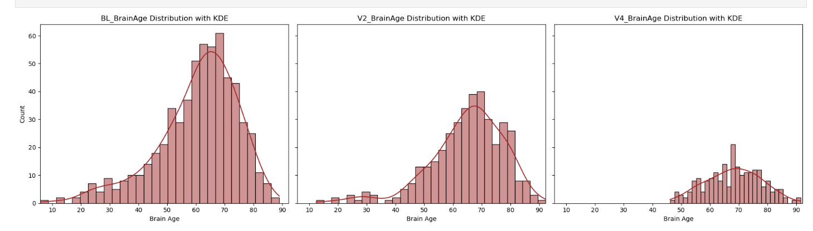
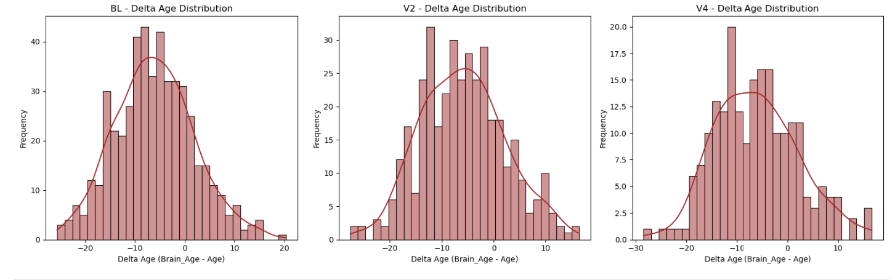
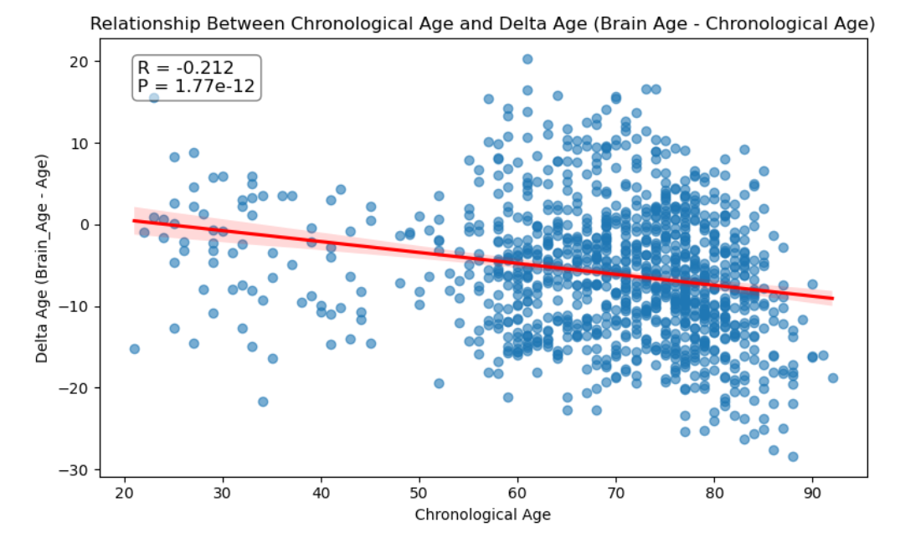
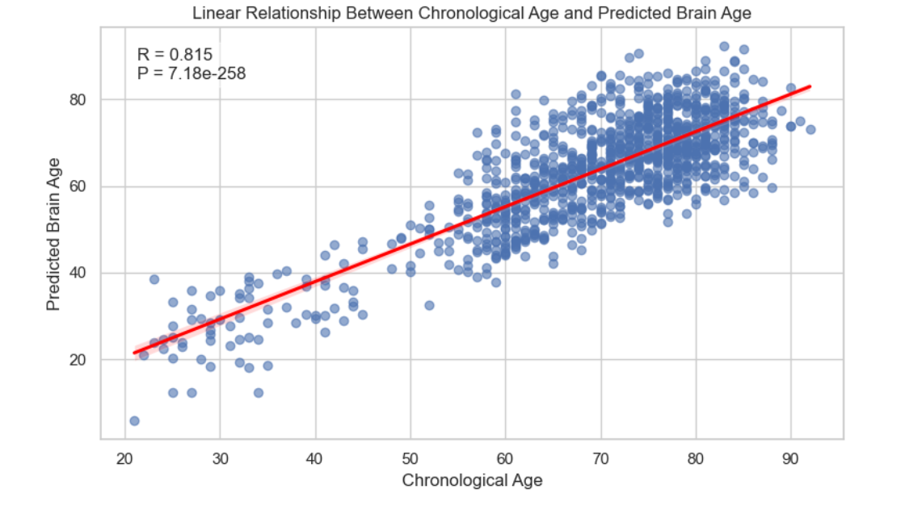
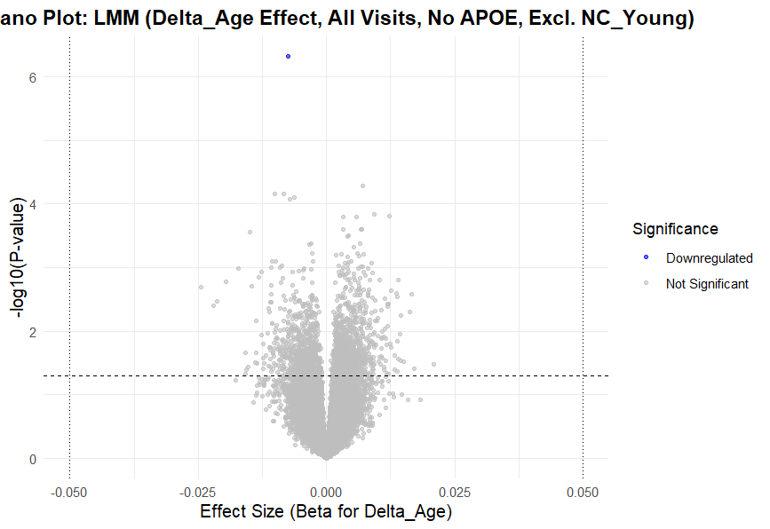
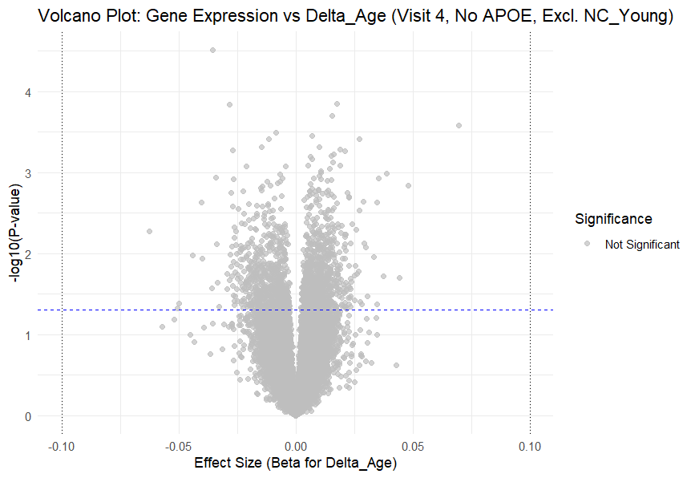
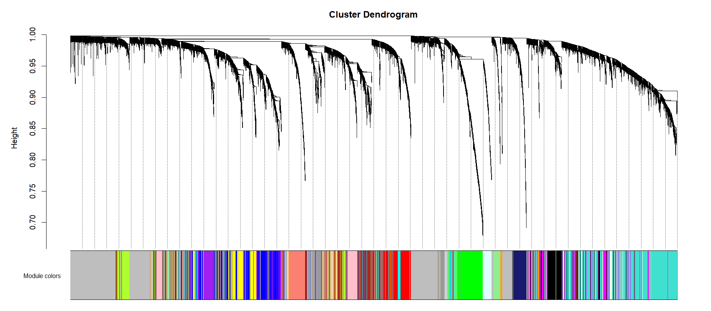
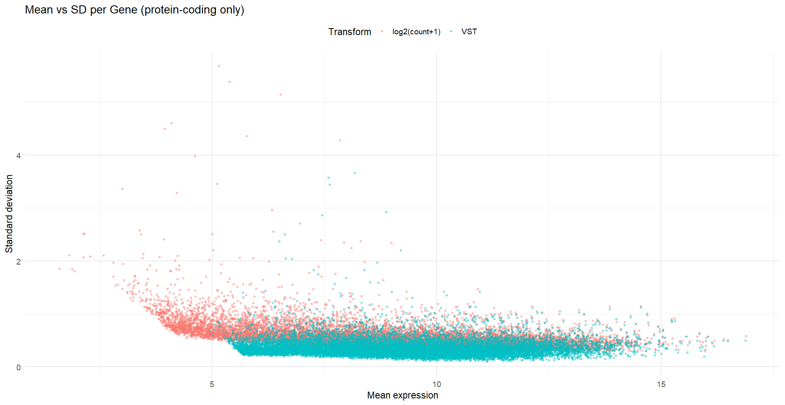

# 🧠 Alzheimer Research KBASE

This repository presents a research workflow for analyzing brain aging in the KBASE cohort using neuroimaging-derived brain age, clinical metadata, and blood-based gene expression data.

The project combines:

- Python-based exploratory data analysis and visualization
- R-based statistical modeling
- Linear Mixed Effects Models (LMER)
- Volcano plot analysis
- Weighted Gene Co-expression Network Analysis (WGCNA)
- Soft-power selection and cluster dendrogram interpretation

The main goal is to study the relationship between **Predicted Brain Age**, **Chronological Age**, **Delta Age**, and **gene expression patterns** related to brain aging and Alzheimer’s disease research.

---

## 📌 Research Background

Alzheimer’s disease and related dementias are complex neurodegenerative disorders where early molecular biomarkers are still limited.

In this project, **Delta Age** is used as a brain-aging biomarker.

**Delta Age = Predicted Brain Age - Chronological Age**

Interpretation:

- **Positive Delta Age:** predicted brain age is older than chronological age, suggesting possible accelerated brain aging.
- **Negative Delta Age:** predicted brain age is younger than chronological age, suggesting possible resilient or younger brain-aging patterns.

This repository focuses on identifying visual, statistical, and gene-expression patterns associated with Delta Age.

---

## 📊 Python-Based Data Visualization

### 🔹 Brain Age Distribution Across Visits

This plot shows the distribution of predicted brain age across different visits such as baseline, visit 2, and visit 4. It helps evaluate how predicted brain age is distributed across the study population.

👉 Code: [`python/Data_Visualisation.py`](python/Data_Visualisation.py)



---

### 🔹 Brain Age Distribution - Additional Visualization

This additional distribution plot supports exploratory analysis of brain age across timepoints and helps compare distribution patterns across visits.

👉 Code: [`python/Data_Visualisation_2.py`](python/Data_Visualisation_2.py)



---

### 🔹 Brain Age Box Plot

This box plot shows the spread, median, variability, and outliers in predicted brain age. It helps identify extreme values and compare brain-age patterns across groups or timepoints.

👉 Code: [`python/Box_Plot.py`](python/Box_Plot.py)


---

### 🔹 Predicted Brain Age vs Chronological Age

This scatter plot evaluates the relationship between chronological age and predicted brain age.

This is one of the most important visualizations because it helps validate whether the brain-age prediction model is capturing age-related structure.

👉 Code: [`python/Scatter_Plot_2.py`](python/Scatter_Plot_2.py)



---

### 🔹 Delta Age vs Chronological Age

This scatter plot shows the relationship between chronological age and Delta Age.

This visualization is important because it helps identify:

- Age-related bias
- Regression-to-the-mean pattern
- Whether Delta Age may need calibration or orthogonalization before downstream modeling

👉 Code: [`python/Scatter_Plot.py`](python/Scatter_Plot.py)



---

## 🧬 R-Based Statistical Analysis

### 🔹 Linear Mixed Effects Model (LMER)

Linear Mixed Effects Models were used to study the association between gene expression and Delta Age while accounting for repeated measurements from the same subjects.

The model framework adjusts for biological and technical covariates such as:

- Age
- Sex
- APOE genotype
- Batch
- RIN value
- Subject-level random effects

This approach helps account for within-subject correlation in longitudinal data.

👉 Code: [`r_analysis/lmer_model.R`](r_analysis/lmer_model.R)

---

## 🌋 Volcano Plot Analysis

Volcano plots were used to visualize gene-level associations with Delta Age.

Each point represents a gene.

- **X-axis:** effect size / beta coefficient for Delta Age
- **Y-axis:** `-log10(p-value)`
- Genes higher on the plot show stronger statistical evidence
- Genes farther left or right show stronger negative or positive effect sizes

Volcano plots help identify candidate genes that may be associated with Delta Age.

---

### 🔹 Global LMER Volcano Plot

This plot shows the global association between gene expression and Delta Age across visits using an LMER-based model.

**Model setting:**

- Delta Age effect across all visits
- No APOE included
- NC_young excluded

👉 Code: [`r_analysis/p.globalmodel_withoutApoe_&_without_NC_Young.R`](r_analysis/p.globalmodel_withoutApoe_&_without_NC_Young.R)



---

### 🔹 Visit-Specific Volcano Plot

This volcano plot shows gene expression association with Delta Age at Visit 4.

**Model setting:**

- Visit 4 analysis
- No APOE included
- NC_young excluded

👉 Code: [`r_analysis/lm_model_withoutApoe_&_without_NC_Young_visitable_4.R`](r_analysis/lm_model_withoutApoe_&_without_NC_Young_visitable_4.R)



---

## 🔗 WGCNA Gene Co-expression Network Analysis

Weighted Gene Co-expression Network Analysis (WGCNA) was used to identify clusters or modules of genes with similar expression patterns.

Instead of testing only one gene at a time, WGCNA groups genes into co-expression modules. These modules can then be tested for association with Delta Age or other clinical traits.

WGCNA is useful because biological processes are often driven by groups of co-regulated genes rather than individual genes alone.

👉 Code: [`r_analysis/deep4.mean.merge0.20.min20.max14000_SD_Q1above.softpower_10.R`](r_analysis/deep4.mean.merge0.20.min20.max14000_SD_Q1above.softpower_10.R)

---

### 🔹 Soft-Power Selection Plot

Soft-power selection is a vital step in WGCNA analysis.

The goal is to select a soft-thresholding power that supports scale-free network topology while maintaining reasonable mean connectivity.

This plot includes two important panels:

#### Scale Independence

This panel shows how well the network follows scale-free topology at different soft-thresholding powers.

#### Mean Connectivity

This panel shows how connected the gene network remains as the soft-thresholding power increases.

A good soft-power choice balances:

- High scale-free topology fit
- Acceptable mean connectivity
- Stable and biologically meaningful network construction


---

### 🔹 WGCNA Cluster Dendrogram

The cluster dendrogram shows hierarchical clustering of genes based on co-expression similarity.

The colored bars represent detected gene modules. Each module contains genes with similar expression behavior across samples.

This plot is important because it shows:

- Gene clustering structure
- Module detection
- Co-expression patterns
- Foundation for downstream module-trait association analysis



---

## 🧪 Gene Filtering and Variance Stabilization

### 🔹 Mean vs SD Plot

The Mean vs SD plot was used to evaluate gene expression variability after preprocessing.

This step helps identify low-variance genes and supports filtering before downstream analysis.

Filtering low-variance genes can:

- Reduce noise
- Improve statistical power
- Improve WGCNA network stability
- Improve regression model performance



---

## 🛠️ Tools and Technologies

### Programming Languages

- Python
- R
- SQL

### Python Libraries

- Pandas
- Matplotlib
- Seaborn

### R Packages and Methods

- lme4
- WGCNA
- glmnet
- Linear Mixed Effects Models
- Volcano plot analysis
- Elastic Net / LASSO
- Gene co-expression network analysis

### Data Types

- MRI-derived predicted brain age
- Chronological age
- Delta Age
- Clinical metadata
- RNA-seq gene expression data

---

## 📁 Project Structure

```text
Alzheimer_Research_KBASE/
│
├── python/
│   ├── Data_Visualisation.py
│   ├── Data_Visualisation_2.py
│   ├── Box_Plot.py
│   ├── Scatter_Plot.py
│   └── Scatter_Plot_2.py
│
├── r_analysis/
│   ├── lmer_model.R
│   ├── p.globalmodel_withoutApoe_&_without_NC_Young.R
│   ├── lm_model_withoutApoe_&_without_NC_Young_visitable_4.R
│   └── deep4.mean.merge0.20.min20.max14000_SD_Q1above.softpower_10.R
│
├── images/
│   ├── Data_Distribution_Graph.png
│   ├── Data_Distribution_Graph_2.png
│   ├── Box_Plot.png
│   ├── Scatter_Plot_1.png
│   ├── Scatter_Plot_2.png
│   ├── Mean_vs_SD_VST_proteinCoding.png
│   ├── p.globalmodel_withoutApoe_&_without_NC_Young.png
│   ├── lm_model_withoutApoe_&_without_NC_Young_visitable_4.png
│   ├── deep4.mean.merge0.20.min20.max14000_SD_Q1above.softpower_10.png
│   └── deep4.mean.merge0.20.min20.max14000_SD_Q1above.softpower_10.CD.png
│
└── README.md
```

---

## 🚀 Key Research Takeaways

- Predicted brain age shows a strong relationship with chronological age, supporting model validity.
- Delta Age analysis helps identify accelerated or resilient brain-aging patterns.
- Delta Age may show age-related bias, so careful correction or interpretation is important before downstream modeling.
- Volcano plots highlight genes associated with Delta Age based on effect size and statistical significance.
- LMER models help analyze gene expression associations while accounting for repeated measures.
- WGCNA allows identification of gene co-expression modules rather than only individual genes.
- Soft-power selection is vital for constructing a biologically meaningful WGCNA network.
- Cluster dendrograms help visualize gene modules and co-expression structure.
- Mean vs SD analysis supports gene filtering and improves downstream modeling stability.

---

## 🤝 Contact

This project is part of my research work in health informatics, neuroimaging, genomics, and Alzheimer’s disease analytics.

Feel free to explore the code, visualizations, and analysis workflow.
